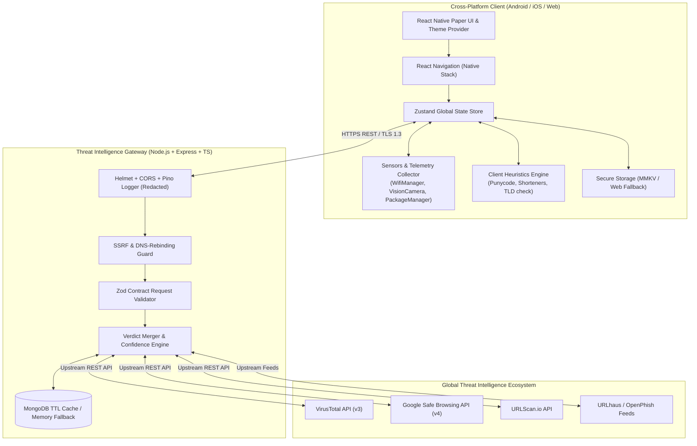
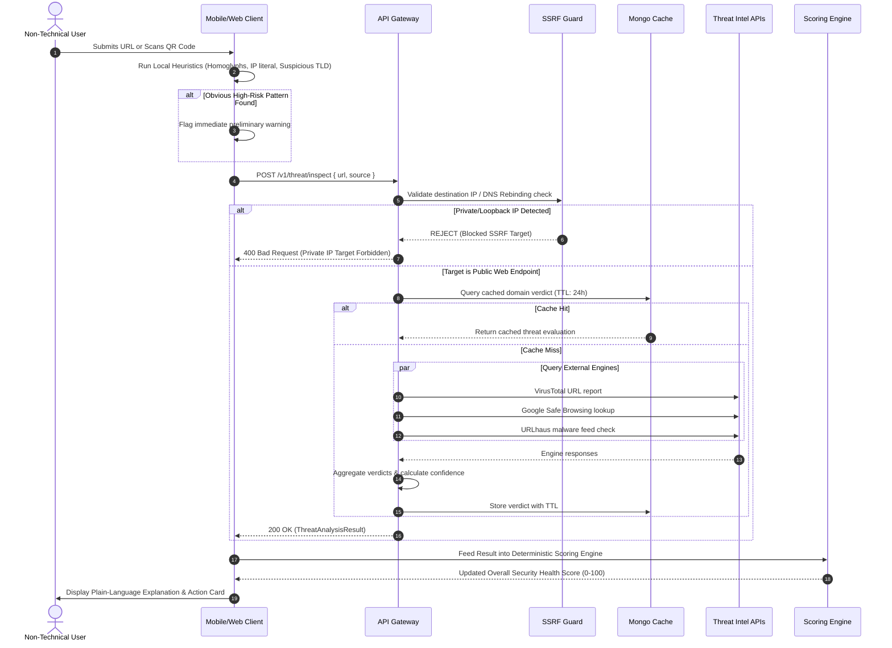

# Cyber Companion — Enterprise Architecture Specification

> **Definitive Architectural Blueprint & Data Flow Reference**

---

## 1. High-Level System Architecture

---

## 2. Threat Intelligence & Scoring Data Flow

---

## 3. Module Interaction Matrix

| Module | Primary Inputs | Internal Processing | Outputs |
| :--- | :--- | :--- | :--- |
| **Wi-Fi Risk** | Current connection SSID, BSSID, protocol | Detect Open/WEP vs WPA2/WPA3, flag captive portals | `WifiTelemetry`, Risk level, Action card |
| **URL Scanner** | User input string or clipboard | Lexical heuristics + Gateway Threat Intel APIs | `ThreatAnalysisResult`, Verdict, Confidence |
| **QR Scanner** | Camera frame or gallery image | Vision barcode decoder + payload classifier | Classified payload, sandbox verification |
| **Permission Analyzer** | Android `PackageManager` manifest | Sensitive permission matrix, dangerous combos | `AppPermissionAudit`, Top risky apps list |
| **Scoring Engine** | Wi-Fi, URL results, app audits, device flags | Pure weighted function ($30/30/20/20$), bounded $0-100$ | `OverallSecurityScore`, Top 3 fixes |
| **Awareness Hub** | Threat results, daily timer | Localized JSON tips, $\le 60$ words, 6th-grade readability | Daily tip card, contextual alert notifications |
