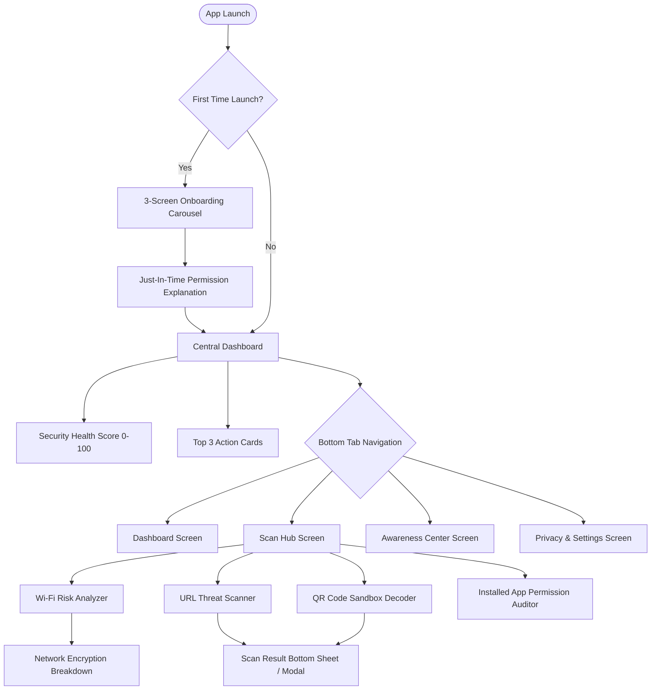

# Cyber Companion — User Flows, Wireframes & Accessibility Specification

---

## 1. Core Application Navigation Flow



---

## 2. Textual Screen Wireframes

### Screen A: Central Dashboard
```text
+-------------------------------------------------------------+
|  CYBER COMPANION                          [Settings Icon]   |
+-------------------------------------------------------------+
|                                                             |
|                    /---------------\                        |
|                   |       85        |                       |
|                   |     SECURE      |                       |
|                    \---------------/                        |
|                                                             |
|   Network: 95/100   |   URLs: 90/100   |   Perms: 80/100    |
+-------------------------------------------------------------+
|  PRIORITIZED ACTIONS (TOP 3)                                |
|  [!] Disconnect from Open Wi-Fi              [+15 pts]      |
|      "Cafe_Guest has no encryption."        [Resolve Now]   |
|                                                             |
|  [!] Flashlight App requests SMS             [+10 pts]      |
|      "High risk: SMS read permission."      [Audit Now]     |
+-------------------------------------------------------------+
|  DAILY TIP OF THE DAY                                       |
|  "Avoid public USB charging ports (Juice Jacking)..."       |
+-------------------------------------------------------------+
|  [ Dashboard ]      [ Scanners ]      [ Awareness ]         |
+-------------------------------------------------------------+
```

### Screen B: Scan Hub & Scanners
```text
+-------------------------------------------------------------+
|  SCAN HUB                                                   |
+-------------------------------------------------------------+
|  [ (o) Wi-Fi Analyzer ]    Current: Home_5G (WPA3 - Secure) |
|  [ [/] URL Scanner ]       Inspect any link before opening  |
|  [ [::] QR Code Sandbox ]  Scan or upload QR code matrices  |
|  [ [*] App Auditor ]       Audit installed app permissions  |
+-------------------------------------------------------------+
|  RECENT INSPECTION VERDICTS                                 |
|  • paypal-security-login.xyz  -> [CRITICAL] Homoglyph alert |
|  • github.com                 -> [SAFE] Clean record        |
+-------------------------------------------------------------+
```

---

## 3. WCAG AA Accessibility & Contrast Compliance Matrix

All color pairings meet WCAG 2.1 AA contrast requirements ($\ge 4.5:1$ for normal text, $\ge 3:1$ for large text and UI boundary controls):

| UI Element | Foreground Color | Background Color | Contrast Ratio | Compliance Status |
| :--- | :--- | :--- | :--- | :--- |
| **Dark Theme Text Primary** | `#F8FAFC` | `#090D16` | **18.7 : 1** | :white_check_mark: WCAG AAA |
| **Dark Theme Text Secondary**| `#94A3B8` | `#090D16` | **7.8 : 1** | :white_check_mark: WCAG AA |
| **Primary Button Accent** | `#FFFFFF` | `#0284C7` | **4.6 : 1** | :white_check_mark: WCAG AA |
| **Safe Risk Badge** | `#D1FAE5` | `#064E3B` | **8.2 : 1** | :white_check_mark: WCAG AAA |
| **Moderate Risk Badge** | `#FEF3C7` | `#78350F` | **9.1 : 1** | :white_check_mark: WCAG AAA |
| **Critical Risk Badge** | `#FFE4E6` | `#881337` | **9.4 : 1** | :white_check_mark: WCAG AAA |
| **Touch Target Dimensions** | $\ge 48 \times 48\text{ dp}$ across all interactive buttons, cards, and tab selectors | Passed | :white_check_mark: Android & iOS Standard |
